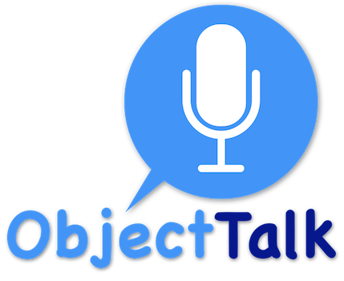

# ObjectTalk Scripting Language

Welcome to the ObjectTalk scripting language. ObjectTalk is a simple
object-oriented scripting language that has evolved over decades and
was heavily influenced by other languages. As a long time IT professional,
I've seen a lot of software development with all its greatness and flaws.
ObjectTalk represents what I think is a well-balanced scripting language
that is easy to learn and can make even a novice look good quickly.
If you are interested in how I got to where we are today, please see the
[history](https://goossens.github.io/ObjectTalk/tour.html#history)
page for the story behind ObjectTalk.

So before continuing, let me address the elephant in the room. Why the
heck would the world need another scripting language? Well, the simple
answer is: it doesn't as we already have more than enough of them! I
wouldn't even suggest ObjectTalk is a language for serious software
development. If you need to deploy code, look elsewhere. ObjectTalk is
however is a good starting point to learn programming and it's also good
if you want to learn language development. Those of you who have ever
looked at the code for compilers and interpreters of populars
languages will probably know what I mean.

Full documentation for ObjectTalk can be found in
[the manual](https://goossens.github.io/ObjectTalk/).

## Prerequisites

ObjectTalk only has a few dependencies. For UNIX based systems like Ubuntu
or Alpine Linux, Docker containers are provided in the docker folder.
If you are running on bare metal or in your own VMs or containers, the
Dockerfiles show which packages are required to build and run ObjectTalk.

On MacOS, you need Xcode installed and a few packages that can be easily
setup using homebrew.

	brew install cmake libuv

Theoretically, ObjectTalk also runs on Windows but since I don't own
a BillyBox, I'll leave it to the community to make that work.

## Special Thanks

This project uses Open Source products without which it would have been
a lot harder to implement ObjectTalk. Special thanks goes to the
following communities:

* [libuv](https://libuv.org) - multi-platform support library with a focus on asynchronous I/O.
* [llhttp](https://llhttp.org) - HTTP protocol parser
* [multipart-parser](https://github.com/francoiscolas/multipart-parser) - HTTP multipart body parser

A special thanks also goes to
[Gunther Rademacher](https://github.com/GuntherRademacher) for his
["RailRoad Diagram Generator"](https://www.bottlecaps.de/rr/ui) which is
used in the documentation to visualize the ObjectTalk grammer.

A final special thanks goes to the team that wrote the
[Swift](https://swift.org) computer language
[documentation](https://swift.org/documentation/). It is awesome and I've
respectfully reused a lot of it to document ObjectTalk.

## License

Copyright (c) 1993-2021 Johan A. Goossens. All rights reserved.

This work is licensed under the terms of the MIT license.
For a copy, see <https://opensource.org/licenses/MIT>.
